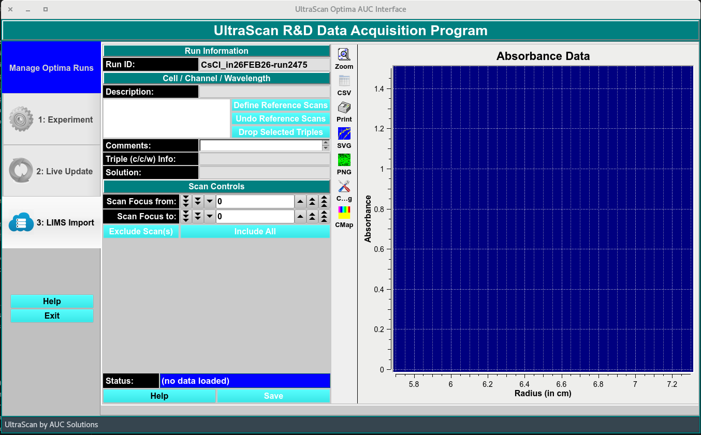
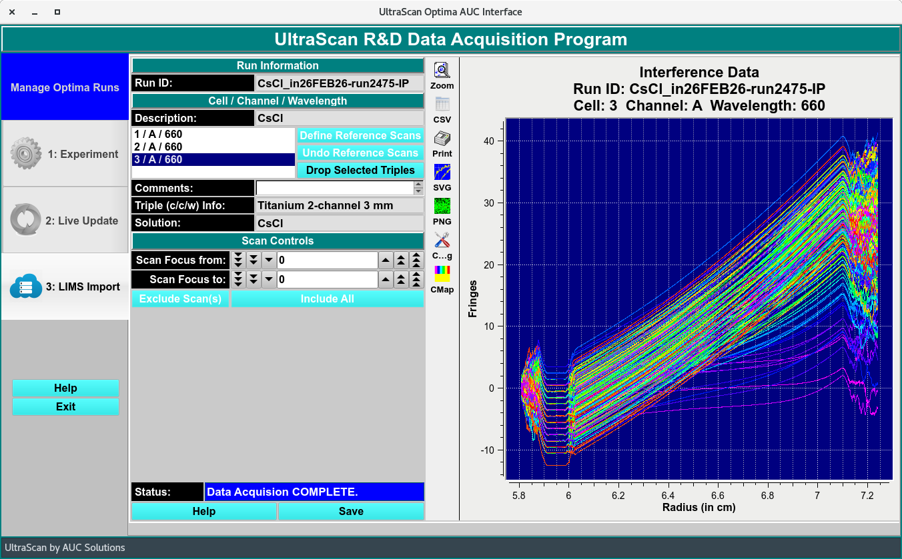
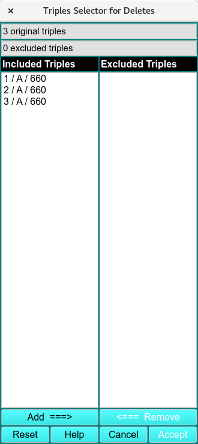

TripleTriplets=====================================================
3: LIMS Import 
=====================================================

.. toctree:: 
  :maxdepth: 3

.. contents:: Index
  :local: 

After a run is completed, the data is imported by first defining the reference scans, allowing users to drop any invalid Triplicates; or scans and the resulting edit profile is then imported into the database by clicking **Save**.

.. rst-class:: 
    :align: center

    **Main Import Window in the Data Acquisition Package**

Once Run is completed, define reference scans, drop Triplicates, and the edit profile is imported to the database. 

.. rst-class:: 
    :align: center

    **Imported data - Import Window**

.. _select_delete:

LIMS Import Functions:
=======================

.. list-table::
  :widths: 20 50

  * - **Run ID:**
    - Run identification label selected by user. 
  * - **Description:**
    - Solution name
  * - **Define Reference Scans**
    - Click bottom to accept the reference selection automatically generated. 
  * - **Undo Reference Scans**
    - Undo reference selection automatically made and make manual selection. 
  * - **Drop Selected Triplicates**
    - Delete selected Triplicate when :ref:`Triplicates Selector for Deletes <select_delete>` window appears. 
  * - **Comments:**
    - Add comments to sample solution label.  
  * - **Triplicate (c/c/w) Info:**
    - Cell Centerpiece. 
  * - **Solution:**
    - Solution added in the `Cells <cells.html>`_ Experiment tab. 
  * - **Scan Focus from:**
    - Select Scan start range to exclude. 
  * - **Scan Focus to:**
    - Select Scan end range to exclude.
  * - **Exclude Scan(s)**
    - Exclude selected scans. 
  * - **Include All**
    - Include all scans that were excluded. 
  * - **Status:**
    - Data and profile status update. 
  * - **Help**
    - Link to the help documentation of this Import Module. 
  * - **Save**
    - Save current profiles.  

