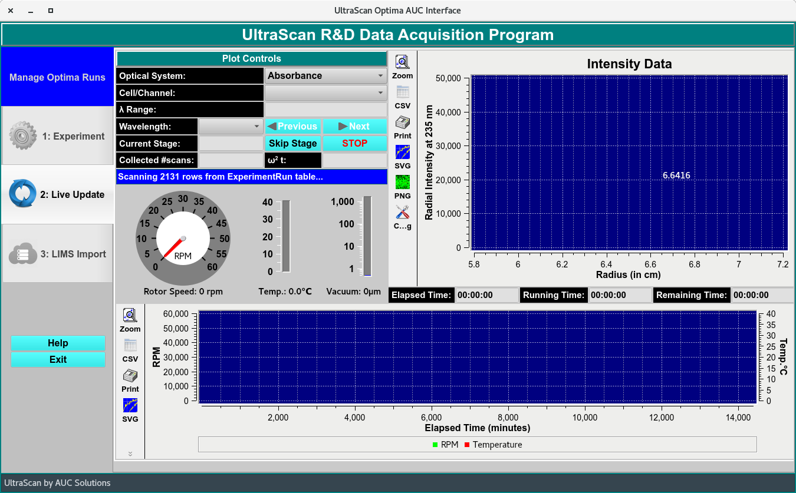
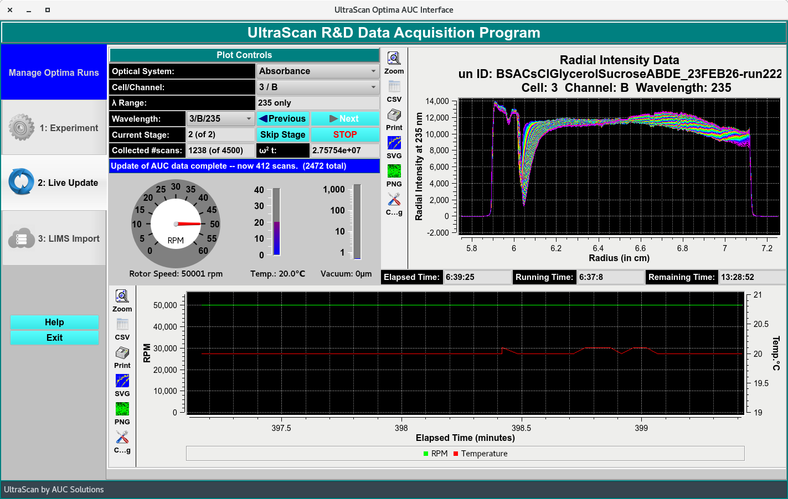

>Triple===================
2: Live Update
===================

.. toctree:: 
  :maxdepth: 3

.. contents:: Index
  :local: 

This live-update module allows users to view the on-going scan collections for protocols sent via the `R&D Data Acquisition Module <../index.html>`_.  

.. rst-class::
    :align: center

    **Live Update Window**

1. Select the run with the RUNNING Optima Run status and in the LIVE_UPDATE stage in **Manage Optima Run** window. Click **Select Optima Run to Follow** to open the live update window. 

Allow the window to update and query all scans. 

.. rst-class::
    :align: center

    **Live Update Window**
    

2. To navigate through the Triple by using the cell/channel pulldown menu, the wavelength pulldown menu which has all the Triples listed and the previous and next bottoms next to the the Wavelength list.

.. Note::
  The **Skip Stage** bottom allows user to skip any of the pre-defined stage (for example: temperature delay) and the **STOP** bottom allows user to stop run. Usually this is to stop run when a lack(s) is notices. It is not recommended to stop a run before the pre-defined run time has finished. Use the `ASTFEM simulation module <../astfem_sim.html>`_ to estimate appropriate runtime for experiment).

3. **Collected scan:** -  The number of scan collected in total. 
4. **Blue text box** -  updates status of collection stage. 
5. **Plots**

  * Top Plot: Displays the scans collected.  
  * Bottom Plot: Displays the speed (rpm), time, temperature (°C ) and ω²T measured for the duration of run. 
