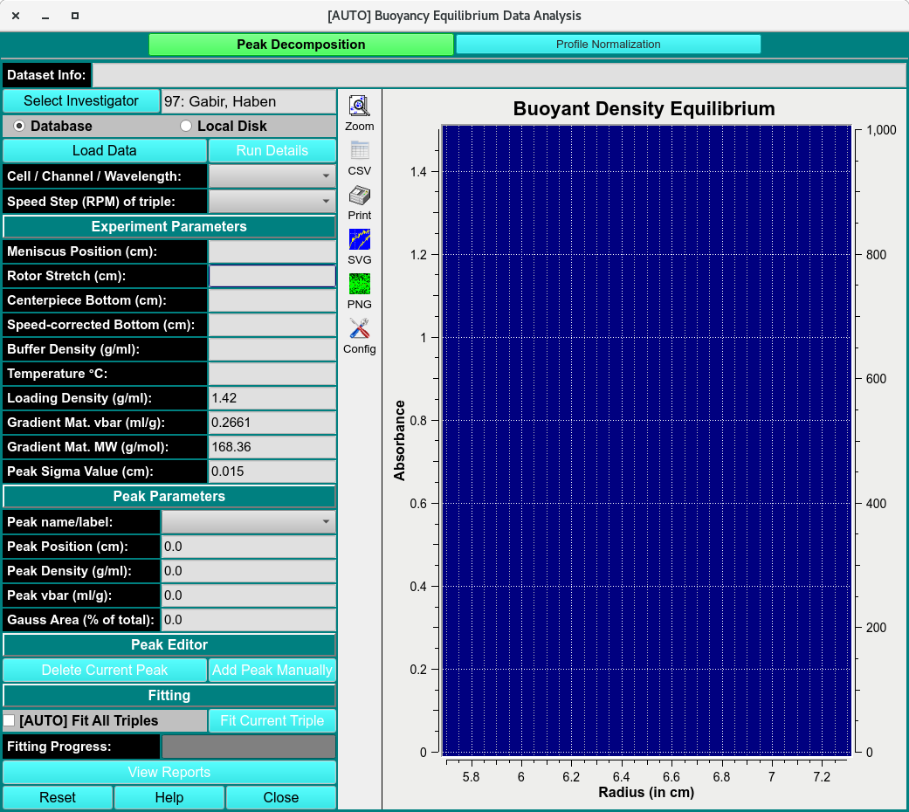

Triplets====================================
Buoyancy Equilibrium Data Analysis
====================================

.. toctree:: 
  :maxdepth: 3

.. contents:: Index
  :local: 
  
 
Peak selection 

.. image:: _static/images/abde-1.png
    :align: center

.. rst-class::
    :align: center

    **ABDE Analysis Main Window**

Peak Decomposition
=====================

.. rst-class::
    :align: center

    **Spectrum Fitter**

.. image:: _static/images/us_buoyanc-2.png
    :align: center

.. rst-class::
    :align: center

    **Spectrum Fitter**

Peak Decom. Functions: 
--------------------------

.. list-table::
  :widths: 20 50
  :header-rows: 0 
  
  * - **Dataset Info:**
    - 
  * - **Database**
    - 
  * - **Local Disk**
    - 
  * - **Load Data**
    - 
  * - **Run Details**
    - 
  * - **Cell /Channel/ Wavelength:**
    - 
  * - **Speed Step (RPM) of Triplicate:**
    - 

Experimental Parameters
~~~~~~~~~~~~~~~~~~~~~~~~~

.. list-table::
  :widths: 20 50
  :header-rows: 0 
  
  * - **Meniscus Position (cm):**
    - 
  * - **Rotor Stretch (cm):**
    - 
  * - **Centerpiece Bottom (cm):**
    - 
  * - **Speed-corrected Bottom (cm):**
    - 
  * - **Buffer Density (g/ml):**
    - 
  * - **Temperature °C:**
    - 
  * - **Loading Density (g/ml):**
    - 
  * - **Gradient Mat. vbar (ml/g):**
    - 
  * - **Gradient Mat. MW (g/mol):**
    - 
  * - **Peak Sigma Value (cm):**
    - 

Peak Parameters
~~~~~~~~~~~~~~~~~~~~~~~~~

.. list-table::
  :widths: 20 50
  :header-rows: 0 

  * - **Peak name/label**
    - 
  * - **Peak Position (cm):**
    -
  * - **Peak Density (g/ml):**
    -
  * - **Peak vbar (ml/g):**
    - 
  * - **Gauss area (1% of total):**
    - 

Peak Editor
~~~~~~~~~~~~~~~~~~~~~~~~~

.. list-table::
  :widths: 20 50
  :header-rows: 0 
  
  * - **Delete Current Peak** 
    -  
  * - **Add Peak Manually**
    - 

Peak Fitting
~~~~~~~~~~~~~~~~~~~~~~~~~

.. list-table::
  :widths: 20 50
  :header-rows: 0 
  
  * - **Fit All Triplicates**
    - 
  * - **Fit Current Triplicates**
    - 
  * - **Fitting Progress:**
    - 
  * - **View Reports**
    - 
  * - **Reset**
    - 
  * - **Help**
    - 
  * - **Close**
    - 

Profile Normalization 
==========================

.. image:: _static/images/us_buoyanc-2.png
    :align: center

.. rst-class::
    :align: center

    **Spectrum Fitter**

Profile Norma. Functions:
--------------------------

.. list-table::
  :widths: 20 50
  :header-rows: 0 

  
  * - **Load Data**
    - 
  * - **Reset Data**
    - 
  * - **Close**
    - 
  * - **Save**
    - 
  * - **List of File(s)**
    - 
  * - **Selected File(s)**
    - 
  * - **Remove Item**
    - 
  * - **Clean List**
    - 
  * - **Limit radius**
    - 
  * - **Pick Two Points**
    - 
  * - **Normalize by Maximum**
    - 
  * - **Pick a Points**
    - 

Plots
---------

.. list-table::
  :widths: 20 50
  :header-rows: 0 

  * - **Raw Data**
    -
  * - **Integral** 
    -
  * - **Normalized**
    -
  * - **Legend**
    -
