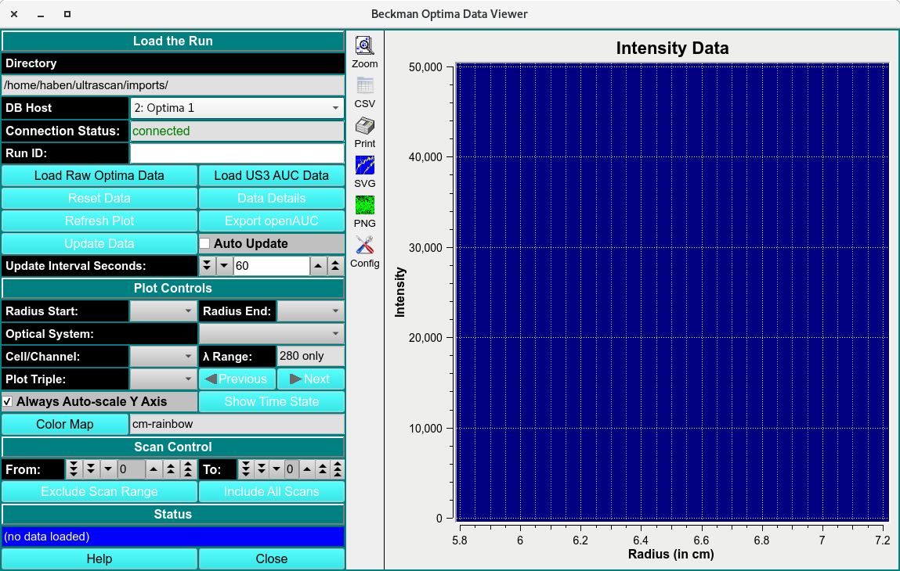
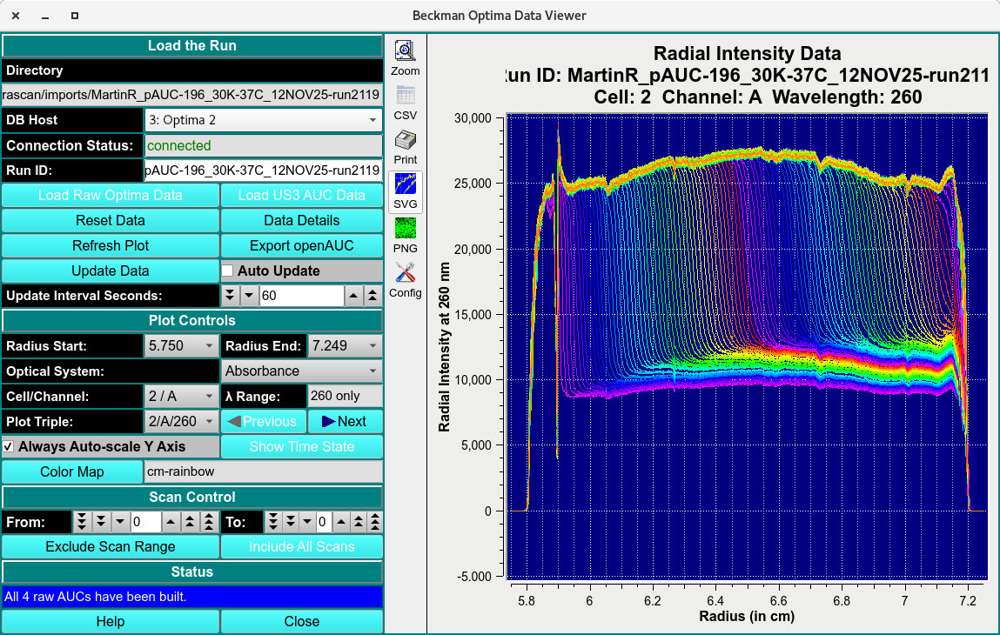
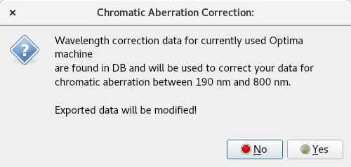

====================================
Beckman Optima Data Viewer
====================================

.. toctree:: 
  :maxdepth: 3

.. contents:: Index
  :local: 

The **Load Raw optima Data** allows the user to visualize and load raw data collected from connected Optima instruments via Data Acquisition or GMP modules and export as OpenAUC format. This module functions during and after data collection.  

.. rst-class::
    :align: center

    **Beckman Optima Data Viewer**

.. rst-class::
    :align: center

    **Loaded Data Viewer**

Data Viewer Process:
=====================

  1. Ensure the instrument is connected by reading a green **connected** text in the **Connection Status:** textbox. 
  2. Select the instrument from the **DB Host** pulldown menu. 
  3. Click **Load Raw Optima Data** for raw optima data or **Load US3 AUC Data** to call a previously imported dataset. 

.. rst-class::
    :align: center

    **Saved Data**
    
Data Viewer Functions:
========================

Load the Run
-------------

.. list-table::
  :widths: 20 50
  :header-rows: 0
  
  * - **Directory Text Box**
    - The location of the directory file the scans will be saved in. 
  * - **DB Host**
    - Name of the optima instrument. 
  * - **Connection Status:**
    - Status of connection to optima instrument(s). 
  * - **Run ID:**
    - Name of the data run id. 
  * - **Load Raw Optima Data:**
    - open the Raw Optima PostgrSQL database runs to load a run. 
  * - **Load US3 AUC Data**
    - Load local disk US3 files using **US3 Directories with Optima-derived .auc Files** dialog. 
  * - **Reset Data**
    - Reset module and remove loaded data. 
  * - **Data Details**
    - This button brings up a report file :ref:`Optima Raw Data Statistics <data_details>` to  that describes additional information associated with the data.
  * - **Refresh Plot**
    - Refreshes the Plot settings to default. 
  * - **Export OpenAUC**
    - Exports .auc files to the directory location. 
  * - **Update Data**
    - Scans the connected instrument for updated data. 
  * - **Auto Update**
    - Set the module to automatically Update. 
  * - **Update Interval Seconds:** 
    - Set the time interval of the update. 

Plot Controls: 
---------------

.. list-table::
  :widths: 20 50
  :header-rows: 0

  * - **Radius Start:**
    - Start of data range. 
  * - **Radius End:**
    - End of data range.
  * - **Optical Systems:**
    - Select the type of data collected.  
  * - **Cell/Channel:**
    - Name of cell and channel. 
  * - **Lambda Range:**
    - Wavelength range of the data collected.  
  * - **Plot Triplicate:**
    - Select the Triplicate to plot. 
  * - **Color Map**
    - Load a color map generated to change the default color schema. 

Scan Controls
----------------

.. list-table::
  :widths: 20 50
  :header-rows: 0

  * - **From:** 
    - Start of scans
  * - **To:**
    - End of scans
  * - **Exclude Scan Range:**
    - Set range of scans to exclude. 
  * - **Include All scans**
    - Include all excluded scans. 

Status
--------

.. list-table::
  :widths: 20 50
  :header-rows: 0

  * - **Description textbox**
    - Module action status box. 
  * - **Help**
    - The Help Documentation of this module.  
  * - **Close**
    - Close window. 

.. _data_details:

.. grid:: 2
  :gutter: 2 

  .. grid-item:: 

    .. image:: _static/images/xpn_report1.png
      :align: left
      :width: 100%

  .. grid-item:: 

    .. image:: _static/images/xpn_report2.png
      :width: 100%
      :align: right

.. rst-class:: center

    **Data Details**

